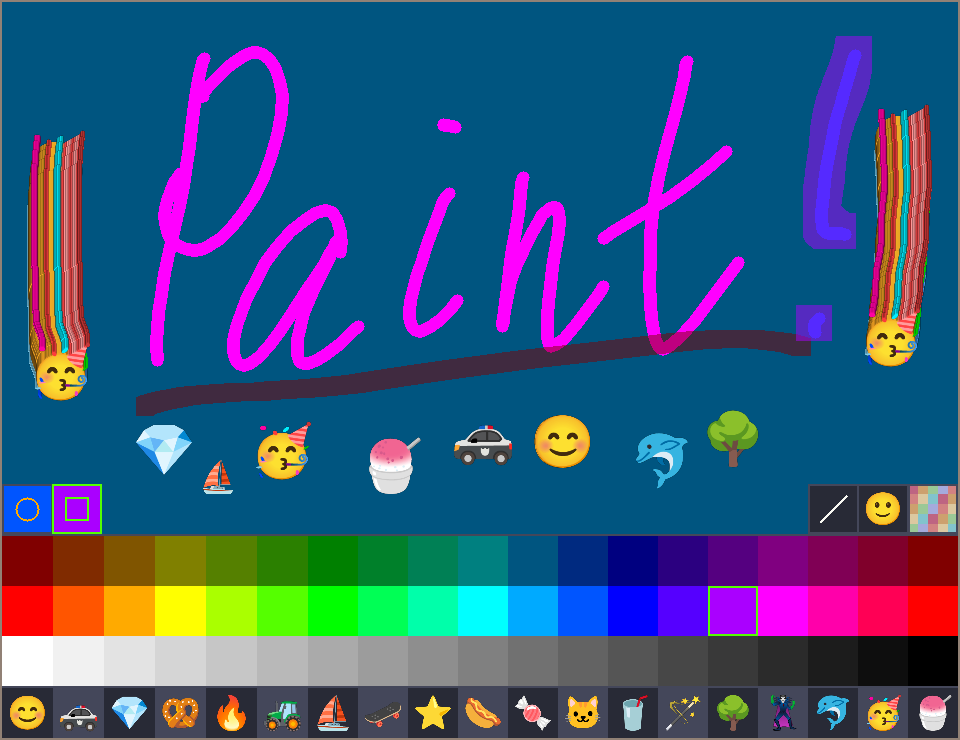

# Simple Paint

A fun and simple painting application vibe coded with C and SDL3.



## Features

- **Multiple Tools**: Includes a standard brush, a semi-transparent water marker, and an emoji brush.
- **Dynamic Palettes**: A vibrant color palette and a shuffled emoji palette that adapt to the window size.
- **Straight Line Mode**: Draw perfect straight lines by holding `Ctrl` or toggling the line mode.
- **Brush Size Control**: Easily adjust the brush size with the mouse wheel or keyboard.
- **UI Toggles**: Show or hide the color and emoji palettes with function keys.
- **Fullscreen Support**: Switch to an immersive fullscreen mode with the `F` key.

## Dependencies

This project requires a modern C compiler (C17), CMake, and the following libraries:

- **SDL3**
- **SDL3_ttf**

Please ensure they are installed on your system before building.

## Building

To build the project, use CMake:

```bash
cmake . -Bbuild -DCMAKE_BUILD_TYPE=Release
cmake --build build
```

## Running

Execute the binary from the build directory:

```bash
./build/paint
```

## Controls

- **Left Mouse Button**: Draw with the selected tool.
- **Right Mouse Button**: Erase (draws with the background color).
- **Middle Mouse Button**: Clear canvas to background color.
- **Mouse Wheel**: Adjust brush size.
- **Mouse Wheel over Palette**: Cycle through the active palette (colors or emojis).
- **`+` / `-`**: Adjust brush size.
- **`1`**: Select Brush tool.
- **`2`**: Select Water Marker tool.
- **`0`**: Select Emoji tool.
- **`Tab`**: Cycle forward through tools.
- **`Ctrl+Tab`**: Cycle backward through tools.
- **`Ctrl` (hold) or `Ctrl`+`Ctrl` (toggle)**: Activate straight line mode.
- **`Shift` (while drawing line)**: Snap straight line to horizontal/vertical.
- **`F1`**: Toggle color palette visibility.
- **`F2`**: Toggle emoji palette visibility.
- **Arrow Keys**: Navigate the selected palette.
- **`F`**: Toggle fullscreen mode.
